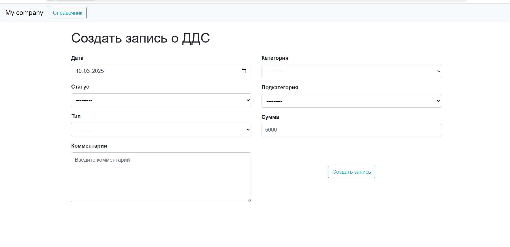

## Инструкция для развертывания
1) Склонируйте себе репозиторий
2) Запустите в IDE - для разработки использовался VS Code
3) Для запуска проекта необходим Django Framework, если его у вас нет - установите
4) Используемая БД - db.sqlite3, стандартная
5) Если необходимо - сделайте миграции - откройте терминал и напишите python manage.py makemigrations, далее - python manage.py migrate
6) Запустите сервер python manage.py runserver(Обычно идет сервер 8000, если не удается запустить, припишите к этой команде другое число, например - 8001)
7) Переходите по ссылке и пользуйтесь!

## Что можно было бы добавить

1) urls.py  - даже сейчас в этом файле уже очень много ссылок, но, к сожалению, я уже не успеваю это исправить
2) разные проверки - можно добавить и еще различных проверок, текущие проверки со стороны сервера:
   проверяется максимальная длина, пустота, и уникальность. Поля обязательны для заполнения
   сумма - неотрицательное число, непустое, проверяется в файле models
   Также проверки есть и со стороны клиента 
3) я не фронтендер и не дизайнер, некоторые моменты со стороны клиента работают не очень - и не везде подстроился стиль кнопок или только что появившиеся данные нельзя изменить, как-то переделать их еще и подумать над этим я также не успеваю, файлы css/js сделаны не идеально
4) Для таблиц можно применить скролл, или пагинацию, например, на главной странице 

Требования выполнены.
### Вопрос, который возник

Я не совсем представляю, какие данные между собой работают, в плане, категория привязана к типу. Тип - пополнение, списание. Может быть, есть ситуации, где одна категория подходит и под списание, и под пополнение? Какую связь реализовывать, многие ко многим или один ко многим? Я реализую связь один ко многим. Хотелось бы, чтобы предметную область описали чуть лучше.

## Скриншоты приложения

### Главная страница

### Страница создания записи(редактирование подобным образом)

### Справочник
